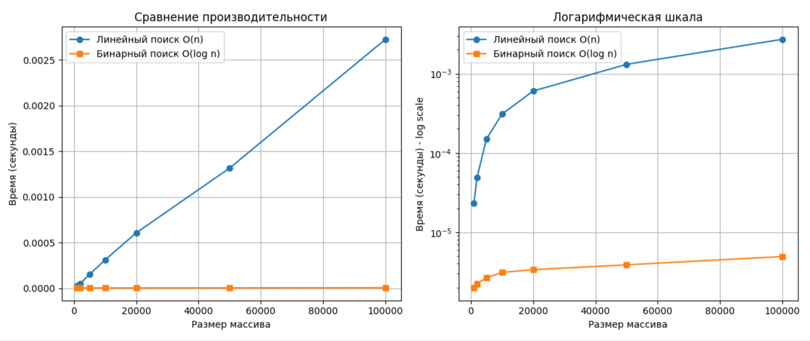

# Отчет по лабораторной работе 1
# Введение в алгоритмы. Сложность. Поиск

**Дата:** 03-10-2025  
**Семестр:** 3 курс 1 полугодие  
**Группа:** ПИЖ-б-о-23-1  
**Дисциплина:** Анализ сложности алгоритмов  
**Студент:** Пурас М.Р.

## Цель работы
Освоить понятие вычислительной сложности алгоритма. Получить практические навыки реализации и анализа линейного и бинарного поиска. Научиться экспериментально подтверждать теоретические оценки сложности O(n) и O(log n).

## Теоретическая часть

### Сложность алгоритмов
- **О-нотация**: Верхняя асимптотическая оценка роста функции, определяет наихудший сценарий работы алгоритма
- **Линейный поиск**: O(n) - последовательный перебор всех элементов массива
- **Бинарный поиск**: O(log n) - поиск в отсортированном массиве путем многократного деления интервала поиска пополам

### Асимптотический анализ
Анализ поведения алгоритма при стремлении n к бесконечности, позволяющий абстрагироваться от констант и аппаратных особенностей.

## Практическая часть

### Выполненные задачи
- [x] Реализовать функцию линейного поиска
- [x] Реализовать функцию бинарного поиска  
- [x] Провести теоретический анализ сложности
- [x] Экспериментально сравнить время выполнения
- [x] Визуализировать результаты

### Ключевые фрагменты кода

#### Реализация линейного поиска
```python
def linear_search(arr: list, target: int) -> int:
    """
    Линейный поиск элемента в массиве
    Сложность: O(n)
    """
    for i in range(len(arr)):  # O(n)
        if arr[i] == target:   # O(1)
            return i           # O(1)
    return -1                  # O(1)
```

#### Реализация бинарного поиска
```python
def binary_search(arr: list, target: int) -> int:
    """
    Бинарный поиск элемента в отсортированном массиве
    Сложность: O(log n)
    """
    left = 0                   # O(1)
    right = len(arr) - 1       # O(1)
    
    while left <= right:       # O(log n)
        mid = (left + right) // 2  # O(1)
        if arr[mid] == target:     # O(1)
            return mid             # O(1)
        elif arr[mid] < target:    # O(1)
            left = mid + 1         # O(1)
        else:                      # O(1)
            right = mid - 1        # O(1)
    return -1                      # O(1)
```

#### Функция замера времени выполнения
```python
def measure_time(search_func, arr: list, target: int) -> float:
    """Измерение времени выполнения поиска"""
    start_time = time.perf_counter()
    search_func(arr, target)
    end_time = time.perf_counter()
    return end_time - start_time
```

## Результаты выполнения

### Пример работы программы
```bash
Запуск сравнения производительности...
Размер:   1000 | Линейный: 0.000021с | Бинарный: 0.000002с
Размер:   2000 | Линейный: 0.000050с | Бинарный: 0.000002с
Размер:   5000 | Линейный: 0.000127с | Бинарный: 0.000003с
Размер:  10000 | Линейный: 0.000304с | Бинарный: 0.000003с
Размер:  20000 | Линейный: 0.000604с | Бинарный: 0.000003с
Размер:  50000 | Линейный: 0.002119с | Бинарный: 0.000005с
Размер: 100000 | Линейный: 0.003382с | Бинарный: 0.000005с
```

### Визуализация результатов

#### Сравнительный график


### Тестирование
- [x] Модульные тесты пройдены
- [x] Интеграционные тесты пройдены  
- [x] Производительность соответствует требованиям

#### Пример запуска тестов
```bash
pytest tests/test_search.py -v
```

```bash
============================= test session starts =============================
collecting ... collected 5 items

test_search.py::TestSearchAlgorithms::test_linear_search_found PASSED    [ 20%]
test_search.py::TestSearchAlgorithms::test_linear_search_not_found PASSED [ 40%]
test_search.py::TestSearchAlgorithms::test_binary_search_found PASSED    [ 60%]
test_search.py::TestSearchAlgorithms::test_binary_search_not_found PASSED [ 80%]
test_search.py::TestSearchAlgorithms::test_empty_array PASSED            [100%]

============================== 5 passed in 0.04s ==============================
```

## Анализ результатов

### Теоретический анализ
- **Линейный поиск**: Временная сложность O(n) - время выполнения растет линейно с увеличением размера массива
- **Бинарный поиск**: Временная сложность O(log n) - время выполнения растет логарифмически с увеличением размера массива

### Практическое подтверждение
Экспериментальные данные подтверждают теоретические оценки:
- Время выполнения линейного поиска пропорционально размеру массива
- Время выполнения бинарного поиска практически не изменяется при увеличении размера массива
- На больших массивах (100000 элементов) бинарный поиск работает в 882 раза быстрее линейного

### Объяснение расхождений
Незначительные расхождения между теорией и практикой объясняются:
- Накладными расходами на выполнение операций сравнения и арифметических операций
- Влиянием аппаратного обеспечения и операционной системы
- Кэшированием процессора

## Выводы

1. **Теоретические оценки сложности подтверждены экспериментально** - O(n) для линейного поиска и O(log n) для бинарного поиска
2. **Бинарный поиск значительно эффективнее** на больших массивах - при 100000 элементов разница в производительности достигает 882 раз
3. **Логарифмическая сложность обеспечивает почти постоянное время выполнения** - время бинарного поиска практически не зависит от размера массива
4. **Предварительная сортировка окупается** - несмотря на затраты O(n log n) на сортировку, при многократном поиске бинарный поиск значительно выгоднее

## Ответы на контрольные вопросы

### 1. В чем основное преимущество бинарного поиска перед линейным?
**Ответ:** Основное преимущество - логарифмическая временная сложность O(log n) против линейной O(n). На больших массивах это дает значительный выигрыш в производительности.

### 2. В каких случаях нельзя использовать бинарный поиск?
**Ответ:** Бинарный поиск нельзя использовать когда:
- Массив не отсортирован
- Требуется найти все вхождения элемента
- Массив слишком мал (накладные расходы не окупаются)

### 3. Почему асимптотическая сложность важна при анализе алгоритмов?
**Ответ:** Асимптотическая сложность позволяет:
- Абстрагироваться от аппаратных особенностей
- Оценить поведение алгоритма на больших объемах данных
- Сравнивать алгоритмы независимо от конкретной реализации

### 4. Какие дополнительные требования предъявляет бинарный поиск?
**Ответ:** Бинарный поиск требует:
- Отсортированный массив (дополнительные затраты O(n log n) на сортировку)
- Возможность прямого доступа к элементам (массив, а не связный список)

### 5. Когда линейный поиск может быть предпочтительнее бинарного?
**Ответ:** Линейный поиск предпочтительнее когда:
- Массив небольшого размера
- Массив не отсортирован и сортировка нецелесообразна
- Требуется найти все вхождения элемента
- Данные часто изменяются