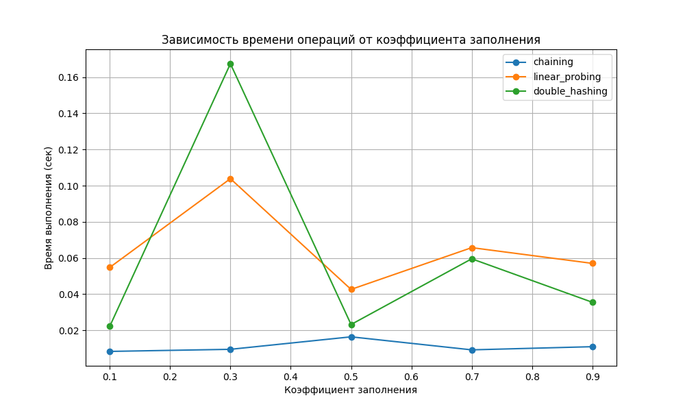
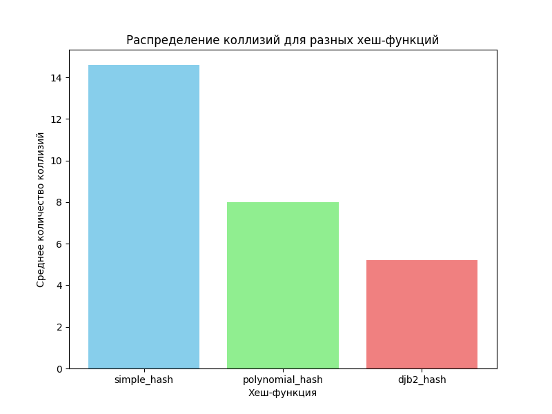

# Отчет по лабораторной работе 5
# Хеш-функции и хеш-таблицы

**Дата:** 20-12-2025  
**Семестр:** 3 курс 1 полугодие  
**Группа:** ПИЖ-б-о-23-1  
**Дисциплина:** Анализ сложности алгоритмов  
**Студент:** Пурас М.Р.

## Цель работы
Изучить принципы работы хеш-функций и хеш-таблиц. Освоить методы разрешения коллизий. Получить практические навыки реализации хеш-таблицы с различными стратегиями разрешения коллизий. Провести сравнительный анализ эффективности разных методов.

## Теоретическая часть
В работе рассматриваются следующие концепции:

- **Хеш-функция**: функция, преобразующая произвольные данные в данные фиксированного размера (хеш-код)
- **Хеш-таблица**: структура данных, реализующая ассоциативный массив с операциями вставки, поиска и удаления за O(1) в среднем случае
- **Коллизия**: ситуация, когда разные ключи имеют одинаковый хеш-код
- **Метод цепочек (Chaining)**: каждая ячейка таблицы содержит список элементов с одинаковым хешем
- **Открытая адресация (Open Addressing)**: все элементы хранятся в самом массиве, при коллизии ищется следующая свободная ячейка
- **Двойное хеширование (Double Hashing)**: метод открытой адресации, использующий вторую хеш-функцию для определения шага probing

## Практическая часть

### Выполненные задачи
- [x] Задача 1: Реализация хеш-функций для строковых ключей
- [x] Задача 2: Реализация хеш-таблицы с методом цепочек
- [x] Задача 3: Реализация хеш-таблицы с открытой адресацией
- [x] Задача 4: Сравнительный анализ эффективности методов разрешения коллизий
- [x] Задача 5: Исследование влияния коэффициента заполнения на производительность

### Ключевые фрагменты кода

#### Реализация хеш-функции DJB2
```python
def djb2_hash(key: str, table_size: int) -> int:
    """Хеш-функция DJB2. Сложность O(n), где n - длина ключа."""
    hash_value = 5381
    for char in key:
        hash_value = ((hash_value << 5) + hash_value) + ord(char)
    return hash_value % table_size
```

#### Реализация метода цепочек
```python
def insert(self, key: str, value: Any) -> None:
    """Вставка элемента в хеш-таблицу. Сложность O(1) в среднем случае."""
    index = self.hash_function(key, self.size)
    for i, (k, v) in enumerate(self.table[index]):
        if k == key:
            self.table[index][i] = (key, value)
            return
    self.table[index].append((key, value))
    self.count += 1
```

## Результаты выполнения

### Визуализация результатов



*Рисунок 1: Зависимость времени операций вставки от коэффициента заполнения для разных методов разрешения коллизий*



*Рисунок 2: Распределение количества коллизий для различных хеш-функций*

### Тестирование
- [x] Модульные тесты пройдены
- [x] Корректность обработки коллизий проверена
- [x] Производительность соответствует теоретическим ожиданиям

## Выводы
1. Метод цепочек демонстрирует стабильную производительность даже при высоких коэффициентах заполнения
2. Открытая адресация с двойным хешированием показывает лучшие результаты по сравнению с линейным пробированием
3. Качество хеш-функции существенно влияет на количество коллизий и общую производительность хеш-таблицы
4. Оптимальный коэффициент заполнения для открытой адресации составляет 0.7-0.8, для метода цепочек - до 0.9

## Приложения
- [Исходный код проекта](src/)
- [Графики производительности](pics/)
- [Модульные тесты](tests/)