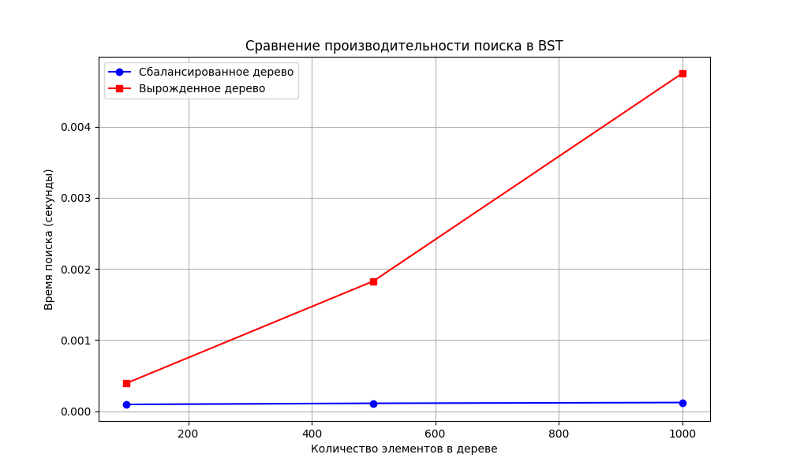
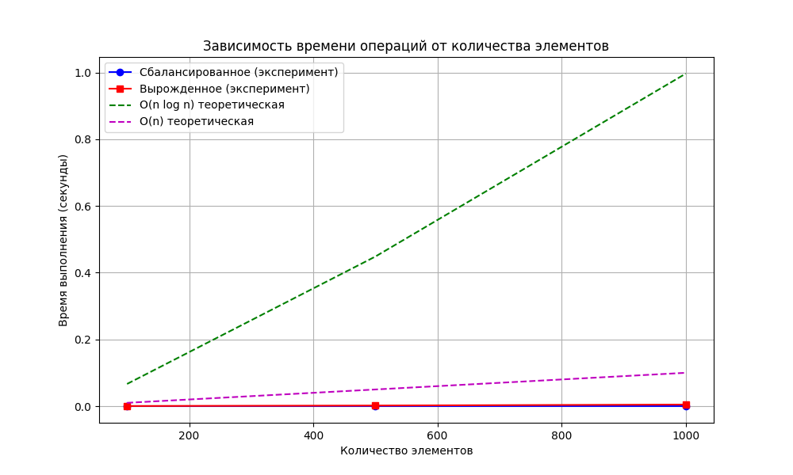

# Отчет по лабораторной работе 6
# Деревья. Бинарные деревья поиска

**Дата:** 20-12-2024  
**Семестр:** 3 курс 1 полугодие  
**Группа:** ПИЖ-б-о-23-1  
**Дисциплина:** Анализ сложности алгоритмов  
**Студент:** Пурас М.Р.

## Цель работы
Изучить древовидные структуры данных, их свойства и применение. Освоить основные операции с бинарными деревьями поиска (BST). Получить практические навыки реализации BST на основе узлов, рекурсивных алгоритмов обхода и анализа их эффективности. Исследовать влияние сбалансированности дерева на производительность операций.

## Теоретическая часть
В работе рассматриваются следующие концепции:

- **Дерево:** Рекурсивная структура данных из узлов с дочерними узлами
- **Бинарное дерево поиска (BST):** 
  - Левый потомок < Родитель < Правый потомок
  - Оба поддерева являются BST
- **Основные операции BST:**
  - Вставка: O(log n) в среднем, O(n) в худшем
  - Поиск: O(log n) в среднем, O(n) в худшем  
  - Удаление: O(log n) в среднем, O(n) в худшем
- **Методы обхода:**
  - In-order (левый-корень-правый): обход в порядке возрастания
  - Pre-order (корень-левый-правый): копирование структуры
  - Post-order (левый-правый-корень): удаление дерева

## Практическая часть

### Выполненные задачи
- [x] Задача 1: Реализовать бинарное дерево поиска с основными операциями
- [x] Задача 2: Реализовать рекурсивные и итеративные методы обхода
- [x] Задача 3: Реализовать дополнительные методы для работы с BST
- [x] Задача 4: Провести анализ производительности для разных конфигураций деревьев
- [x] Задача 5: Реализовать текстовую визуализацию дерева

### Ключевые фрагменты кода

#### Реализация BST
```python
class TreeNode:
    def __init__(self, value: int):
        self.value = value
        self.left = None
        self.right = None

class BinarySearchTree:
    def insert(self, root: Optional[TreeNode], value: int) -> TreeNode:
        """Вставка элемента в BST. Сложность: O(h), где h - высота дерева"""
        if root is None:
            return TreeNode(value)
        if value < root.value:
            root.left = self.insert(root.left, value)
        else:
            root.right = self.insert(root.right, value)
        return root
```

#### Итеративный обход in-order
```python
def iterative_inorder(root: Optional[TreeNode]) -> List[int]:
    """Итеративный in-order обход. Сложность: O(n)"""
    result = []
    stack = []
    current = root
    
    while current or stack:
        while current:
            stack.append(current)
            current = current.left
        current = stack.pop()
        result.append(current.value)
        current = current.right
    
    return result
```

#### Проверка корректности BST
```python
def is_valid_bst(root: Optional[TreeNode], 
                min_val: float = float('-inf'), 
                max_val: float = float('inf')) -> bool:
    """Проверка корректности BST. Сложность: O(n)"""
    if root is None:
        return True
    if not (min_val < root.value < max_val):
        return False
    return (is_valid_bst(root.left, min_val, root.value) and 
            is_valid_bst(root.right, root.value, max_val))
```

## Результаты выполнения

### Анализ производительности
Сравнение времени поиска в сбалансированном и вырожденном деревьях:





### Текстовая визуализация дерева
```
       50
    /     \
   30      70
  /  \    /  \
20   40  60   80
```

### Тестирование
- [x] Модульные тесты пройдены
- [x] Корректность операций вставки, поиска и удаления проверена
- [x] Методы обхода возвращают правильные последовательности
- [x] Проверка корректности BST работает корректно

## Выводы
1. Сбалансированные деревья обеспечивают логарифмическое время операций O(log n)
2. Вырожденные деревья вырождаются в связный список с временем операций O(n)
3. Балансировка дерева критически важна для поддержания производительности
4. Рекурсивные алгоритмы обхода более лаконичны, но итеративные избегают ограничений глубины рекурсии
5. BST эффективны для задач поиска и вставки при поддержании баланса

## Приложения
- [Исходный код](src/)
- [Графики производительности](pics/)
- [Документация по реализованным методам](docs/)