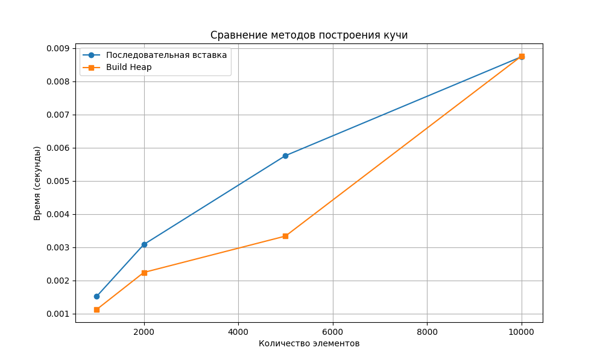
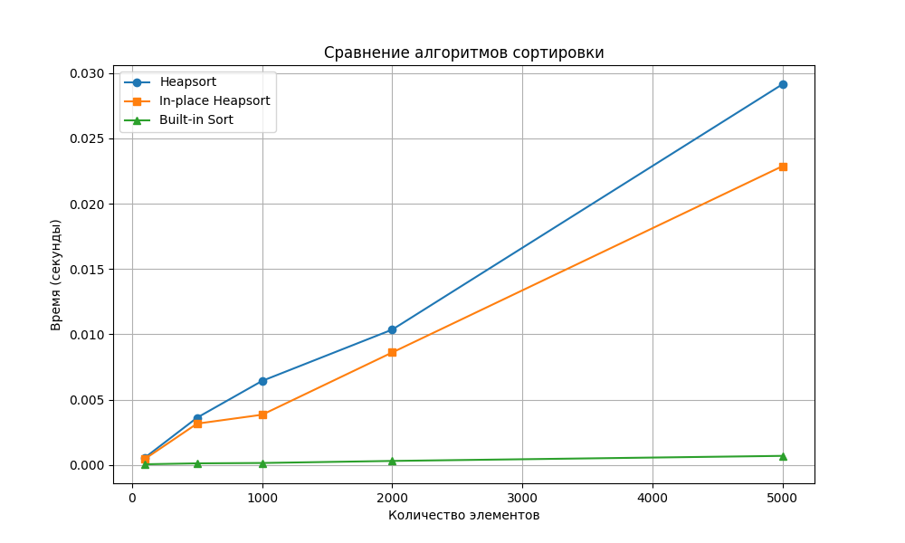
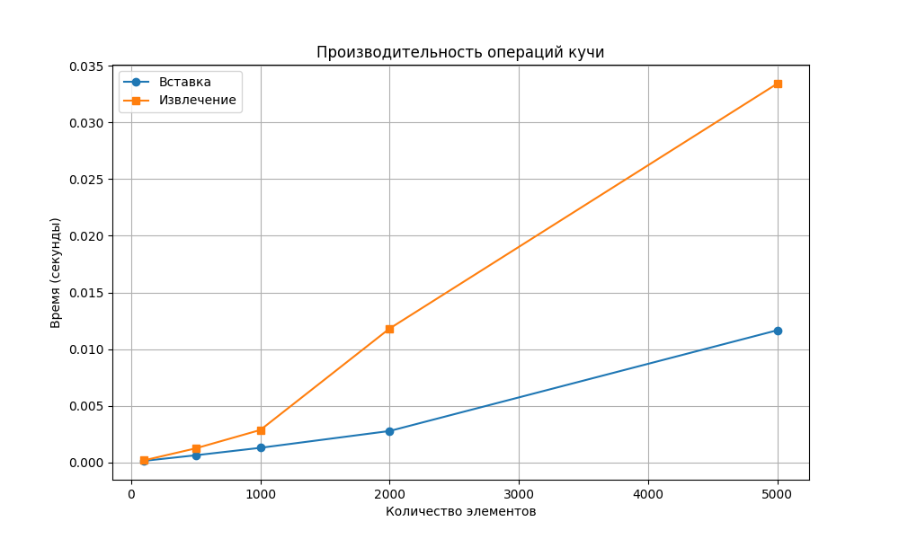

# Отчет по лабораторной работе 7
# Кучи (Heaps)

**Дата:** 20-12-2025  
**Семестр:** 3 курс 1 полугодие  
**Группа:** ПИЖ-б-о-23-1  
**Дисциплина:** Анализ сложности алгоритмов  
**Студент:** Пурас М.Р.

## Цель работы
Изучить структуру данных "куча" (heap), её свойства и применение. Освоить основные операции с кучей (добавление, извлечение корня) и алгоритм её построения. Получить практические навыки реализации кучи на основе массива. Исследовать эффективность основных операций и применение кучи для сортировки и реализации приоритетной очереди.

## Теоретическая часть
Куча - специализированная древовидная структура данных, удовлетворяющая свойству кучи. Является полным бинарным деревом. Рассматриваются два типа куч:
- **Min-Heap**: значение в любом узле меньше или равно значениям его потомков
- **Max-Heap**: значение в любом узле больше или равно значениям его потомков

Куча эффективно реализуется на основе массива, где для узла с индексом i:
- родитель: (i-1)//2
- левый потомок: 2*i + 1  
- правый потомок: 2*i + 2

Основные операции:
- **Вставка**: O(log n)
- **Извлечение корня**: O(log n)
- **Построение кучи**: O(n)

## Практическая часть

### Выполненные задачи
- [x] Задача 1: Реализовать структуру данных "куча" на основе массива
- [x] Задача 2: Реализовать основные операции и алгоритм построения кучи
- [x] Задача 3: Реализовать алгоритм сортировки кучей (Heapsort)
- [x] Задача 4: Реализовать приоритетную очередь на основе кучи
- [x] Задача 5: Провести анализ сложности операций

### Ключевые фрагменты кода

#### Реализация MinHeap
```python
class MinHeap:
    def __init__(self) -> None:
        self.heap: List[Any] = []
    
    def insert(self, value: Any) -> None:
        """Вставка элемента в кучу. Сложность: O(log n)"""
        self.heap.append(value)
        self._sift_up(len(self.heap) - 1)
    
    def extract_min(self) -> Any:
        """Извлечение минимального элемента. Сложность: O(log n)"""
        if not self.heap:
            raise IndexError("Куча пуста")
        
        min_val = self.heap[0]
        last_val = self.heap.pop()
        
        if self.heap:
            self.heap[0] = last_val
            self._sift_down(0)
        
        return min_val
```

#### In-place сортировка кучей
```python
def heapsort_inplace(arr: List[Any]) -> None:
    """In-place сортировка кучей. Сложность: O(n log n)"""
    n = len(arr)
    
    # Построение max-heap
    for i in range(n // 2 - 1, -1, -1):
        _sift_down_max(arr, n, i)
    
    # Извлечение элементов из кучи
    for i in range(n - 1, 0, -1):
        arr[0], arr[i] = arr[i], arr[0]
        _sift_down_max(arr, i, 0)
```

## Результаты выполнения

### Тестирование
- [x] Модульные тесты для кучи пройдены
- [x] Модульные тесты для сортировки пройдены
- [x] Модульные тесты для приоритетной очереди пройдены
- [x] Производительность соответствует теоретической сложности

### Анализ производительности

#### Сравнение методов построения кучи


#### Сравнение алгоритмов сортировки


#### Сложность операций кучи


## Выводы
1. Куча эффективна для операций вставки и извлечения корня за O(log n)
2. Алгоритм построения кучи за O(n) эффективнее последовательной вставки за O(n log n)
3. Heapsort демонстрирует стабильную производительность O(n log n) в худшем случае
4. Приоритетная очередь на основе кучи оптимальна для задач с динамическими приоритетами