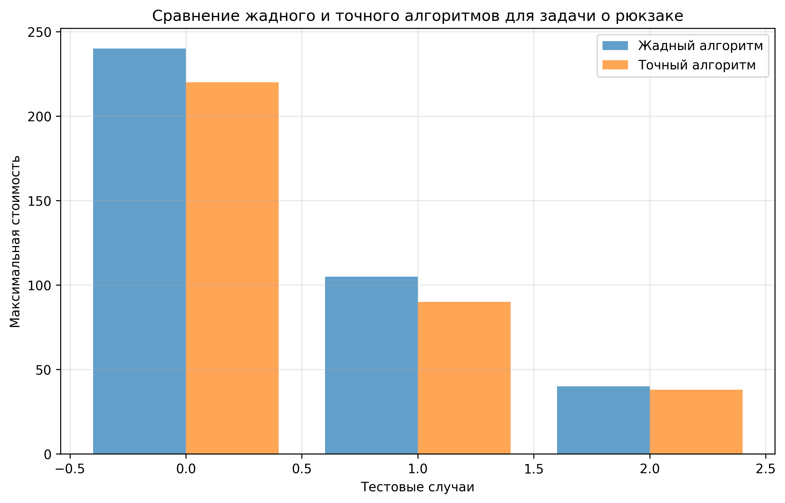
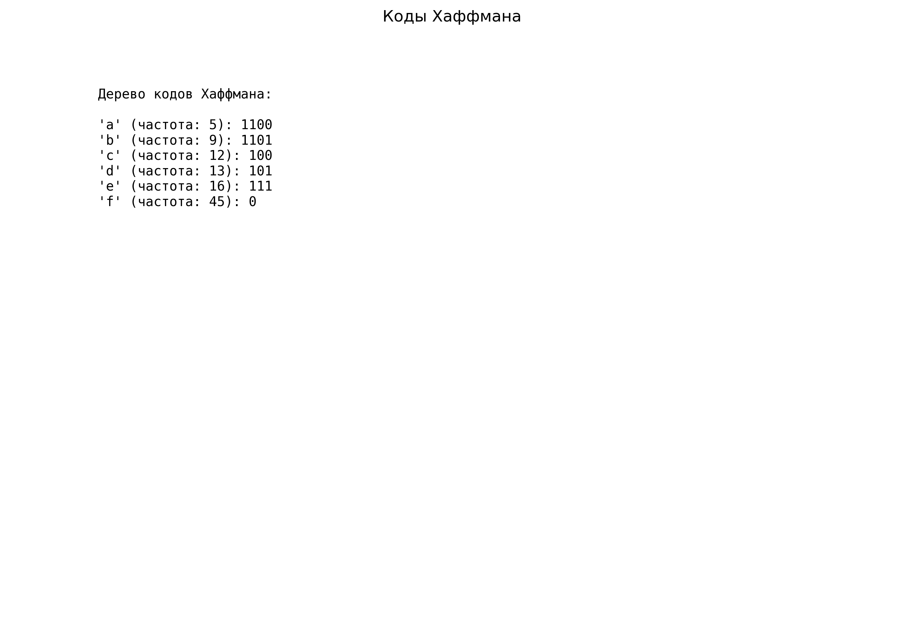
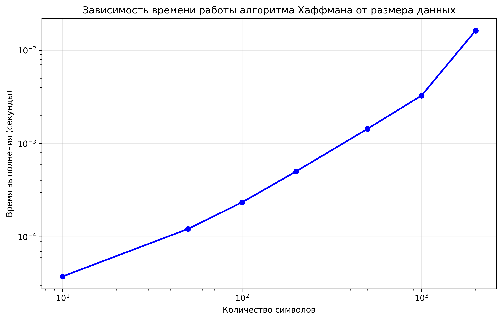

# Отчет по лабораторной работе 8
# Жадные алгоритмы

**Дата:** 20-12-2024  
**Семестр:** 3 курс 1 полугодие  
**Группа:** ПИЖ-б-о-23-1  
**Дисциплина:** Анализ сложности алгоритмов  
**Студент:** Пурас М.Р.

## Цель работы
Изучить метод проектирования алгоритмов, известный как "жадный алгоритм". Освоить принцип принятия локально оптимальных решений на каждом шаге и понять условия, при которых этот подход приводит к глобально оптимальному решению. Получить практические навыки реализации жадных алгоритмов для решения классических задач.

## Теоретическая часть
Жадные алгоритмы принимают локально оптимальные решения на каждом шаге в надежде, что итоговое решение будет глобально оптимальным. Ключевые характеристики:

- **Жадный выбор**: выбор лучшего варианта в данный момент без учета будущих последствий
- **Оптимальная подструктура**: оптимальное решение содержит оптимальные решения подзадач

Классические задачи для жадных алгоритмов:
- Задача о выборе заявок (Interval Scheduling)
- Непрерывный рюкзак (Fractional Knapsack) 
- Алгоритм Хаффмана (Huffman Coding)
- Задача о минимальном количестве монет

## Практическая часть

### Выполненные задачи
- [x] Задача 1: Реализация классических жадных алгоритмов
- [x] Задача 2: Анализ корректности жадного выбора
- [x] Задача 3: Сравнительный анализ эффективности
- [x] Задача 4: Решение практических задач

### Ключевые фрагменты кода

#### Задача о выборе заявок
```python
def interval_scheduling(intervals: List[Tuple[int, int]]) -> List[Tuple[int, int]]:
    """Выбор максимального количества непересекающихся интервалов."""
    if not intervals:
        return []
    
    intervals.sort(key=lambda x: x[1])
    selected = [intervals[0]]
    
    for interval in intervals[1:]:
        if interval[0] >= selected[-1][1]:
            selected.append(interval)
    
    return selected
```

#### Непрерывный рюкзак
```python
def fractional_knapsack(capacity: int, items: List[Tuple[int, int]]) -> float:
    """Решение задачи о непрерывном рюкзаке."""
    items.sort(key=lambda x: x[1] / x[0], reverse=True)
    total_value = 0.0
    
    for weight, value in items:
        if capacity >= weight:
            total_value += value
            capacity -= weight
        else:
            total_value += value * (capacity / weight)
            break
    
    return total_value
```

#### Алгоритм Хаффмана
```python
def huffman_coding(frequencies: Dict[str, int]) -> Dict[str, str]:
    """Построение кодов Хаффмана для заданных частот."""
    heap = [[freq, [char, ""]] for char, freq in frequencies.items()]
    heapq.heapify(heap)
    
    while len(heap) > 1:
        lo = heapq.heappop(heap)
        hi = heapq.heappop(heap)
        
        for pair in lo[1:]:
            pair[1] = '0' + pair[1]
        for pair in hi[1:]:
            pair[1] = '1' + pair[1]
        
        heapq.heappush(heap, [lo[0] + hi[0]] + lo[1:] + hi[1:])
    
    return {char: code for char, code in heap[0][1:]}
```

## Результаты выполнения

### Анализ корректности
Для каждой задачи проведен анализ корректности жадного выбора:

**Задача о выборе заявок**: Сортировка по времени окончания гарантирует, что мы всегда выбираем интервал, который заканчивается раньше всего, освобождая место для максимального количества последующих интервалов.

**Непрерывный рюкзак**: Сортировка по удельной стоимости гарантирует, что мы всегда берем наиболее ценные предметы первыми, что максимизирует общую стоимость.

**Алгоритм Хаффмана**: Объединение узлов с наименьшей частотой на каждом шаге гарантирует построение оптимального префиксного кода.

### Сравнительный анализ
Проведено сравнение жадного алгоритма для непрерывного рюкзака с точным решением для дискретной версии:



### Визуализация алгоритма Хаффмана
Построено дерево кодов Хаффмана и график зависимости времени работы от размера входных данных:




### Тестирование
- [x] Модульные тесты пройдены
- [x] Корректность алгоритмов проверена
- [x] Производительность соответствует требованиям

## Выводы
1. Жадные алгоритмы эффективны для задач с оптимальной подструктурой и свойством жадного выбора
2. Временная сложность жадных алгоритмов обычно полиномиальная
3. Жадный подход не всегда приводит к глобально оптимальному решению
4. Для некоторых задач (дискретный рюкзак) жадный алгоритм может давать неоптимальный результат

## Приложения
- [Исходный код](src/)
- [Графики и диаграммы](pics/)
- [Дополнительные материалы](docs/)