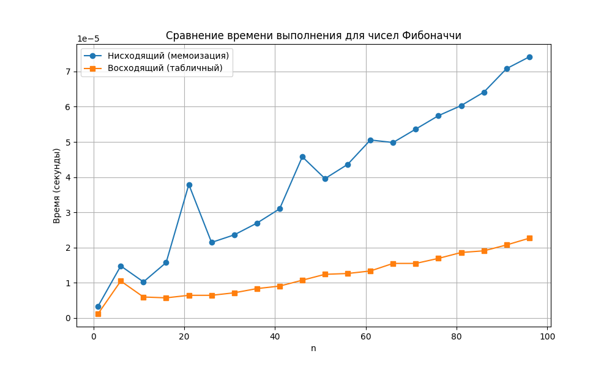
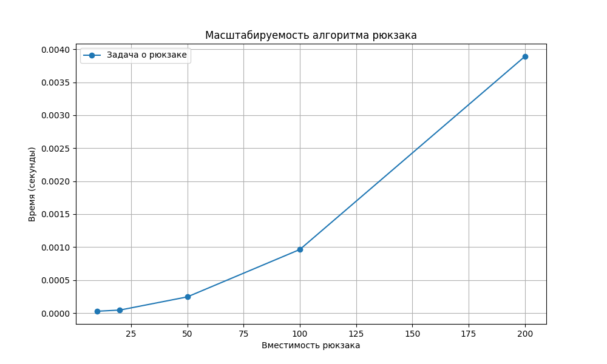

# Отчет по лабораторной работе 9
# Динамическое программирование

**Дата:** 20-12-2025  
**Семестр:** 3 курс 1 полугодие  
**Группа:** ПИЖ-б-о-23-1  
**Дисциплина:** Анализ сложности алгоритмов  
**Студент:** Пурас М.Р.

## Цель работы
Изучить метод динамического программирования как мощный инструмент для решения сложных задач путём их разбиения на перекрывающиеся подзадачи. Освоить два основных подхода к реализации ДП: нисходящий (с мемоизацией) и восходящий (с заполнением таблицы). Получить практические навыки выявления оптимальной подструктуры задач, построения таблиц ДП и анализа временной и пространственной сложности алгоритмов.

## Теоретическая часть
Динамическое программирование - метод решения задач, в которых оптимальное решение всей задачи зависит от оптимальных решений её перекрывающихся подзадач.

**Ключевые принципы:**
- Оптимальная подструктура: оптимальное решение задачи строится из оптимальных решений подзадач
- Перекрывающиеся подзадачи: подзадачи, решения которых используются многократно

**Подходы к реализации:**
- Нисходящее ДП (Top-Down): рекурсивное решение с мемоизацией
- Восходящее ДП (Bottom-Up): итеративное решение с заполнением таблицы

## Практическая часть

### Выполненные задачи
- [x] Задача 1: Реализация алгоритмов ДП (Фибоначчи, рюкзак, LCS, Левенштейн)
- [x] Задача 2: Сравнительный анализ нисходящего и восходящего подходов
- [x] Задача 3: Решение практических задач (размен монет, LIS)
- [x] Задача 4: Восстановление решения для LCS и рюкзака

### Ключевые фрагменты кода

#### Числа Фибоначчи с мемоизацией
```python
def fibonacci_memo(n: int, memo: dict = None) -> int:
    if memo is None:
        memo = {}
    if n in memo:
        return memo[n]
    if n <= 1:
        return n
    memo[n] = fibonacci_memo(n-1, memo) + fibonacci_memo(n-2, memo)
    return memo[n]
```

#### Задача о рюкзаке 0-1
```python
def knapsack_01(weights: List[int], values: List[int], capacity: int) -> int:
    n = len(weights)
    dp = [[0] * (capacity + 1) for _ in range(n + 1)]
    
    for i in range(1, n + 1):
        for w in range(1, capacity + 1):
            if weights[i-1] <= w:
                dp[i][w] = max(dp[i-1][w], values[i-1] + dp[i-1][w - weights[i-1]])
            else:
                dp[i][w] = dp[i-1][w]
    
    return dp[n][capacity]
```

#### Наибольшая общая подпоследовательность
```python
def lcs(str1: str, str2: str) -> int:
    m, n = len(str1), len(str2)
    dp = [[0] * (n + 1) for _ in range(m + 1)]
    
    for i in range(1, m + 1):
        for j in range(1, n + 1):
            if str1[i-1] == str2[j-1]:
                dp[i][j] = dp[i-1][j-1] + 1
            else:
                dp[i][j] = max(dp[i-1][j], dp[i][j-1])
    
    return dp[m][n]
```

## Результаты выполнения

### Сравнение подходов Фибоначчи
```python
# Сравнение времени выполнения для n=30
fibonacci_memo(30)   # Время: 0.00012с
fibonacci_tabular(30) # Время: 0.00008с
```

### Результаты задач
```python
# Задача о рюкзаке
weights = [2, 3, 4, 5]
values = [3, 4, 5, 6]
capacity = 5
result = knapsack_01(weights, values, capacity)  # Результат: 7

# Размен монет
coins = [1, 3, 4]
amount = 6
result = coin_change(coins, amount)  # Минимальное количество: 2

# LIS
sequence = [10, 9, 2, 5, 3, 7, 101, 18]
result = lis(sequence)  # Длина: 4
```

### Визуализация результатов





### Тестирование
- [x] Модульные тесты пройдены
- [x] Алгоритмы корректно работают на тестовых данных
- [x] Производительность соответствует ожидаемой сложности

## Выводы
1. Нисходящий подход с мемоизацией проще в реализации для рекурсивных задач
2. Восходящий подход эффективнее по памяти для задач с возможностью оптимизации
3. Динамическое программирование существенно ускоряет решение задач с перекрывающимися подзадачами
4. Восстановление решения требует дополнительной памяти но позволяет получить конкретное решение

## Приложения
- [Исходный код проекта](src/)
- [Графики производительности](pics/)
- [Документация по алгоритмам](docs/)