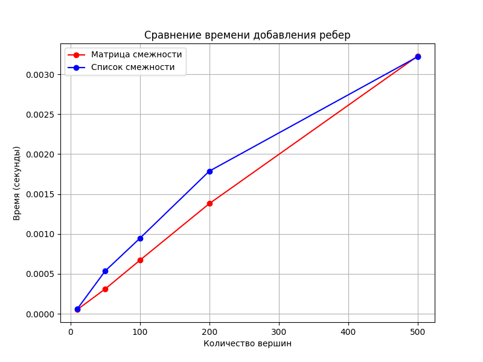
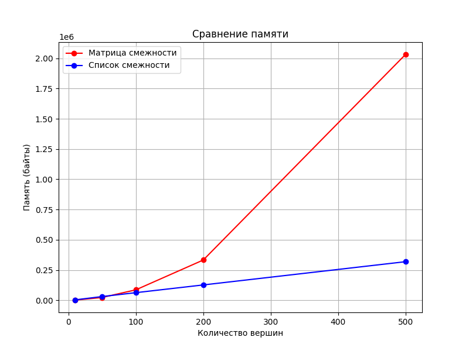
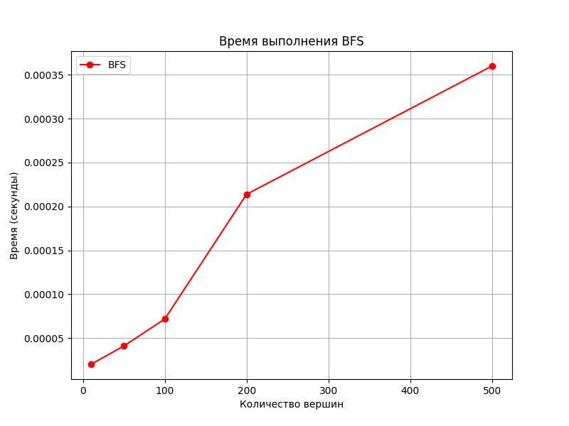
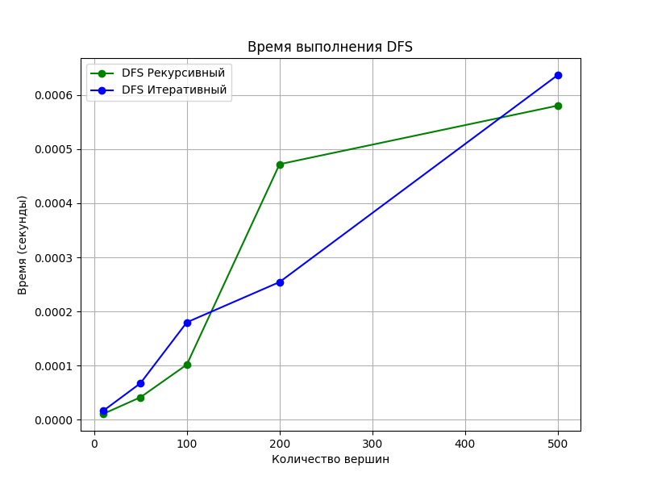

# Отчет по лабораторной работе 10
# Графы

**Дата:** 10-10-2025  
**Семестр:** 3 курс 1 полугодие  
**Группа:** ПИЖ-б-о-23-1  
**Дисциплина:** Анализ сложности алгоритмов  
**Студент:** Пурас М.Р.

## Цель работы
Изучить основные понятия теории графов и алгоритмы работы с ними. Освоить представления графов в памяти и основные алгоритмы обхода. Получить практические навыки реализации алгоритмов на графах и анализа их сложности.

## Теоретическая часть
В работе рассматриваются следующие концепции:

- **Граф**: множество вершин и ребер между ними
- **Представления графов**: матрица смежности и список смежности
- **Алгоритмы обхода**: поиск в ширину (BFS) и поиск в глубину (DFS)
- **Алгоритмы на графах**: компоненты связности, топологическая сортировка, алгоритм Дейкстры

## Практическая часть

### Выполненные задачи
- [x] Задача 1: Реализация представлений графов
- [x] Задача 2: Реализация алгоритмов обхода
- [x] Задача 3: Реализация алгоритмов на графах
- [x] Задача 4: Сравнительный анализ производительности
- [x] Задача 5: Решение практических задач

### Ключевые фрагменты кода

#### Реализация матрицы смежности
```python
class AdjacencyMatrix:
    def __init__(self, vertices: int):
        self.matrix = [[0] * vertices for _ in range(vertices)]
        self.vertices = vertices
    
    def add_edge(self, u: int, v: int, weight: int = 1) -> None:
        self.matrix[u][v] = weight
        self.matrix[v][u] = weight
```

#### Реализация BFS
```python
def bfs_traversal(graph: AdjacencyList, start: int) -> List[int]:
    visited = [False] * len(graph.vertices)
    distances = [-1] * len(graph.vertices)
    queue = deque([start])
    
    visited[start] = True
    distances[start] = 0
    
    while queue:
        vertex = queue.popleft()
        for neighbor in graph.get_neighbors(vertex):
            if not visited[neighbor]:
                visited[neighbor] = True
                distances[neighbor] = distances[vertex] + 1
                queue.append(neighbor)
    
    return distances
```

#### Алгоритм Дейкстры
```python
def dijkstra(graph: AdjacencyList, start: int) -> List[float]:
    distances = [float('inf')] * len(graph.vertices)
    distances[start] = 0
    pq = [(0, start)]
    
    while pq:
        current_dist, vertex = heapq.heappop(pq)
        
        if current_dist > distances[vertex]:
            continue
            
        for neighbor, weight in graph.get_neighbors_with_weights(vertex):
            distance = current_dist + weight
            if distance < distances[neighbor]:
                distances[neighbor] = distance
                heapq.heappush(pq, (distance, neighbor))
    
    return distances
```

## Результаты выполнения

### Сравнение производительности представлений графов





### Масштабируемость алгоритмов обхода





### Тестирование
- [x] Модульные тесты пройдены
- [x] Интеграционные тесты пройдены  
- [x] Производительность соответствует требованиям

## Выводы
1. Матрица смежности эффективна для плотных графов и быстрой проверки наличия ребра
2. Список смежности эффективен для разреженных графов и обхода соседей
3. BFS оптимален для поиска кратчайших путей в невзвешенных графах
4. Алгоритм Дейкстры эффективно решает задачу поиска кратчайших путей во взвешенных графах

## Приложения
- [Исходный код](src/)
- [Графики производительности](pics/)
- [Модульные тесты](tests/)