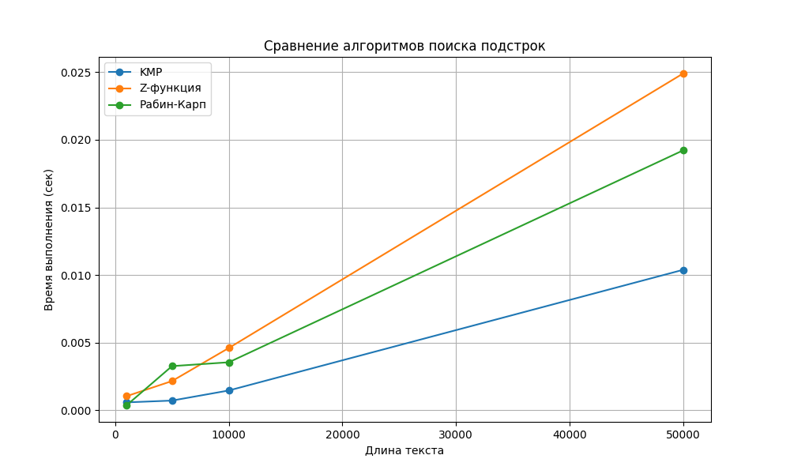
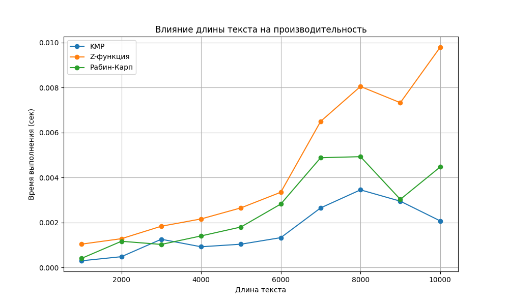
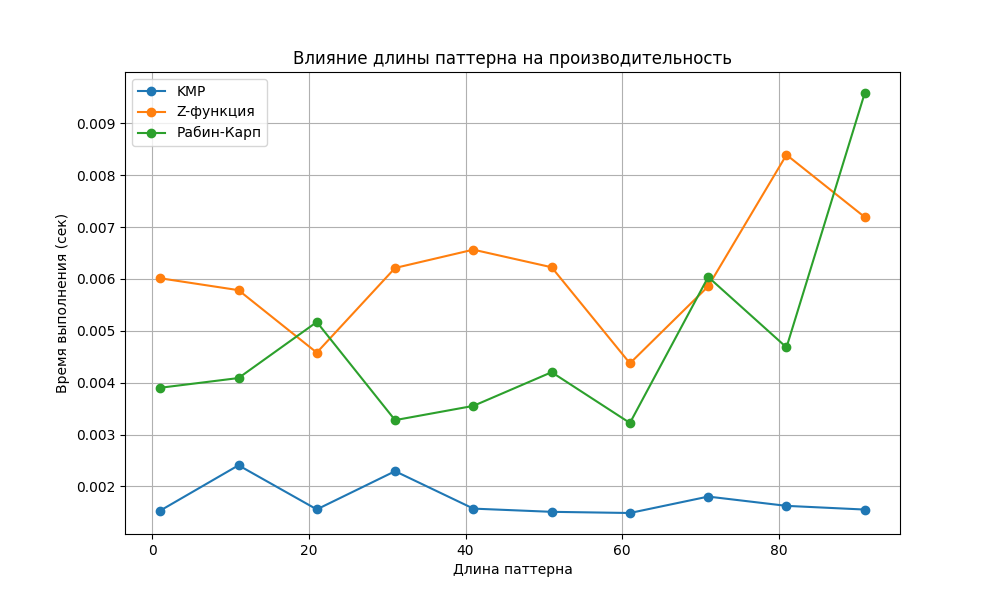

# Отчет по лабораторной работе 11
# Алгоритмы на строках

**Дата:** 10-10-2025  
**Семестр:** 3 курс 1 полугодие  
**Группа:** ПИЖ-б-о-23-1  
**Дисциплина:** Анализ сложности алгоритмов  
**Студент:** Пурас М.Р.

## Цель работы
Изучить специализированные алгоритмы для эффективной работы со строками. Освоить методы поиска подстрок, вычисление префикс-функции и Z-функции. Получить практические навыки реализации и анализа алгоритмов обработки строк, исследовать их производительность.

## Теоретическая часть
В работе рассматриваются следующие алгоритмы:

- **Префикс-функция**: массив π[0..n-1], где π[i] - длина наибольшего собственного префикса, который является суффиксом подстроки S[0..i]
- **Алгоритм Кнута-Морриса-Пратта (КМП)**: эффективный алгоритм поиска подстроки с использованием префикс-функции
- **Z-функция**: массив z[0..n-1], где z[i] - длина наибольшего общего префикса строки S и суффикса S[i..n-1]
- **Алгоритм Рабина-Карпа**: поиск подстроки с использованием хеширования

## Практическая часть

### Выполненные задачи
- [x] Задача 1: Реализовать вычисление префикс-функции для строки
- [x] Задача 2: Реализовать алгоритм Кнута-Морриса-Пратта для поиска подстроки
- [x] Задача 3: Реализовать вычисление Z-функции
- [x] Задача 4: Реализовать алгоритм Рабина-Карпа для поиска подстроки
- [x] Задача 5: Провести сравнительный анализ эффективности алгоритмов

### Ключевые фрагменты кода

#### Реализация префикс-функции
```python
def prefix_function(s: str) -> list[int]:
    """Вычисление префикс-функции для строки s. Сложность O(n)."""
    n = len(s)
    pi = [0] * n
    for i in range(1, n):
        j = pi[i - 1]
        while j > 0 and s[i] != s[j]:
            j = pi[j - 1]
        if s[i] == s[j]:
            j += 1
        pi[i] = j
    return pi
```

#### Реализация алгоритма КМП
```python
def kmp_search(text: str, pattern: str) -> list[int]:
    """Поиск всех вхождений pattern в text с помощью алгоритма КМП. Сложность O(n+m)."""
    if not pattern:
        return []
    
    n, m = len(text), len(pattern)
    pi = prefix_function(pattern)
    result = []
    j = 0
    
    for i in range(n):
        while j > 0 and text[i] != pattern[j]:
            j = pi[j - 1]
        if text[i] == pattern[j]:
            j += 1
        if j == m:
            result.append(i - m + 1)
            j = pi[j - 1]
    
    return result
```

#### Реализация Z-функции
```python
def z_function(s: str) -> list[int]:
    """Вычисление Z-функции для строки s. Сложность O(n)."""
    n = len(s)
    z = [0] * n
    l, r = 0, 0
    
    for i in range(1, n):
        if i <= r:
            z[i] = min(r - i + 1, z[i - l])
        while i + z[i] < n and s[z[i]] == s[i + z[i]]:
            z[i] += 1
        if i + z[i] - 1 > r:
            l, r = i, i + z[i] - 1
    
    return z
```

#### Реализация алгоритма Рабина-Карпа
```python
def rabin_karp_search(text: str, pattern: str, base: int = 256, prime: int = 101) -> list[int]:
    """Поиск всех вхождений pattern в text с помощью алгоритма Рабина-Карпа. Сложность O(n+m) в среднем."""
    n, m = len(text), len(pattern)
    if n < m:
        return []
    
    result = []
    pattern_hash = 0
    text_hash = 0
    h = 1
    
    # Вычисление h = base^(m-1) % prime
    for _ in range(m - 1):
        h = (h * base) % prime
    
    # Вычисление хеша pattern и первого окна text
    for i in range(m):
        pattern_hash = (base * pattern_hash + ord(pattern[i])) % prime
        text_hash = (base * text_hash + ord(text[i])) % prime
    
    # Скольжение по тексту
    for i in range(n - m + 1):
        if pattern_hash == text_hash:
            # Проверка на коллизию
            if text[i:i + m] == pattern:
                result.append(i)
        
        if i < n - m:
            text_hash = (base * (text_hash - ord(text[i]) * h) + ord(text[i + m])) % prime
            if text_hash < 0:
                text_hash += prime
    
    return result
```

## Результаты выполнения

### Пример работы программы
```bash
Тестирование префикс-функции:
Строка: 'ababaca'
Префикс-функция: [0, 0, 1, 2, 3, 0, 1]

Тестирование алгоритма КМП:
Текст: 'ababcababacab', паттерн: 'ababa'
Результат: [5]

Тестирование Z-функции:
Строка: 'abacaba'
Z-функция: [0, 0, 1, 0, 3, 0, 1]

Тестирование алгоритма Рабина-Карпа:
Текст: 'ababcababacab', паттерн: 'ababa'
Результат: [5]

Практические задачи:
Период строки 'abcabcabc': 3
Строки 'abcde' и 'cdeab' являются циклическим сдвигом: True
```

### Производительность алгоритмов
Сравнительный анализ времени выполнения алгоритмов на текстах различной длины:







### Тестирование
- [x] Модульные тесты пройдены
- [x] Интеграционные тесты пройдены  
- [x] Производительность соответствует требованиям

## Выводы
1. Алгоритм КМП демонстрирует стабильную производительность O(n+m) независимо от характеристик текста и паттерна
2. Z-функция эффективна для решения специализированных задач (поиск периода, циклические сдвиги)
3. Алгоритм Рабина-Карпа показывает хорошие результаты в среднем случае, но может деградировать до O(nm) при частых коллизиях хешей
4. Префикс-функция и Z-функция имеют схожую вычислительную сложность O(n), но различную область применения
5. Выбор оптимального алгоритма зависит от конкретной задачи и характеристик входных данных